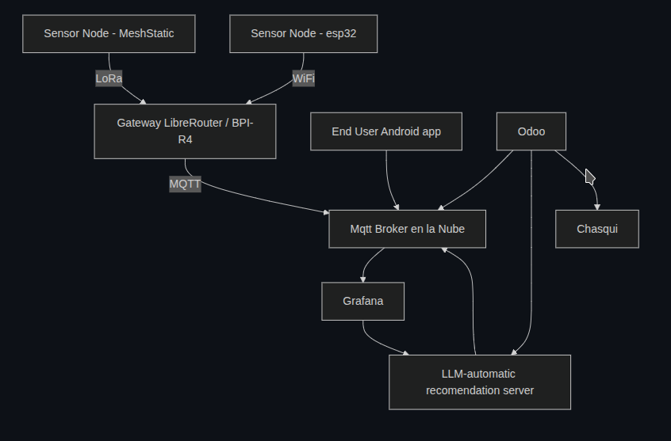

# Ecosistema informático para la agricultura familiar

Estamos trabajando en Una arquitectura IoT para Zonas Rurales con Libremesh y MeshStatic (LoRa)

**¿Qué es un Ecosistema Tecnológico para Economía Social y la Producción Sustentable?**

Es un conjunto integrado de subsistemas, cada uno enfocado en producciones específicas, que incluye:

Innovaciones tecnológicas adaptadas a las necesidades locales
Caracterización productiva de los procesos
Curaduría de materiales bibliográficos y manuales técnico-productivos
Definición de requerimientos físicos y estructurales
Interfaces de usuario amigables y accesibles
Este Ecosistema gira alrededor de las necesidades reales, explicitadas en 1ra persona por los protagonistas de la Economía Social y la Producción Sustentable. Implica proponer soluciones a través de la Innovación tecnológicas social y ambientalmente pertinentes. Cada subsistema se construye y ensambla a partir de un núcleo común de HW o SF, al cual se van anexando, de manera modular, una diversidad de complementos, capas o funcionalidades (físicos o de SW) acordes a las necesidades específicas de cada producción o contexto. Estos subsistemas se integran de manera complementaria, en un sistema mayor, que no solo da respuestas a un producción o cadena específica; sino que intenta acompañar al sujeto de la economía y la producción social

La modularidad facilita la adaptación a diferentes realidades productivas y promueve la apropiación tecnológica por parte los trabajadores y los productores.

## Objetivo

Diseñar una arquitectura de hardware y software para redes de sensores IoT en zonas rurales con vegetación densa, utilizando tecnologías de bajo consumo y largo alcance como LoRa, y conectividad comunitaria basada en Libremesh y LibreRouter.

---

## Componentes Principales

### 1. Nodo IoT medición o actuación

### 1.a Sensor Node - MeshStatic

### 1.b Sensor Node - ESP32 Now

### 2. Gateway Rural (LibreRouter + LoRa USB o MESHSTICK)

### 3. Broker MQTT en la Nube

### 4. Cliente de Datos + Visualización (Android app)

### 5. Odoo

## Diagrama General

