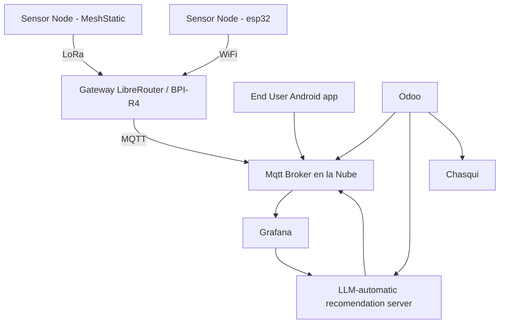

# Ecosistema informático para la agricultura familiar

Una arquitectura IoT para Zonas Rurales con Libremesh y MeshStatic (LoRa)

## Objetivo

Diseñar una arquitectura de hardware y software para redes de sensores IoT en zonas rurales con vegetación densa, utilizando tecnologías de bajo consumo y largo alcance como LoRa, y conectividad comunitaria basada en Libremesh y LibreRouter.

---

## Componentes Principales

### 1. Nodo IoT medición o actuación

### 1.a Sensor Node - MeshStatic

### 1.b Sensor Node - ESP32 Now

### 2. Gateway Rural (LibreRouter + LoRa USB o MESHSTICK)

---

### 3. Broker MQTT en la Nube

---

### 4. Cliente de Datos + Visualización (Android app)

---

### 5. Odoo

---

## Diagrama General

